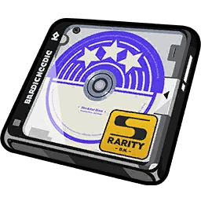
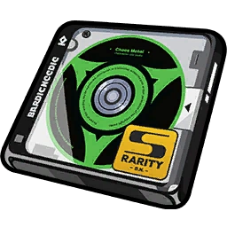
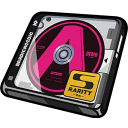
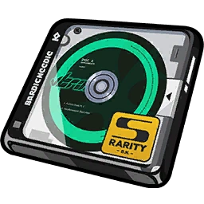

# Drive Disc Simulator

<p align="center">
  
  
  
  
  
  
</p>

Simulate ZZZ drive disc drops and bardic needle for ZZZ.

---

### Features

* **Routine Cleanup Simulator**: Test farming runs with battery presets, stage selection, custom substat priority ranking, Min Roll Value (RV) thresholds, and auto-dismantling.
* **Bardic Needle Tuning Station**: Craft partition-targeted (1–6) or random S-Rank drive discs with interactive socket selection and main stat pool inspection.
* **Drive Disc Storage**: Filter, sort by Crit Value (CV) or Roll Value (RV), lock favorites, and batch dismantle unwanted drops for Hi-Fi Master Copies.

---

### Links

* **Figma prototype**: https://www.figma.com/proto/LGQkcl0HzjhbLOzERAxdOK/Untitled?node-id=0-1&t=nY8egXL2lV2wKvXx-1
* **Website**: 

---

### Later Planned Features

* Player UID assisted agent disc drive helper

---

### Getting Started

```bash
dotnet run
```
Navigate to `http://localhost:5063` in your browser.
